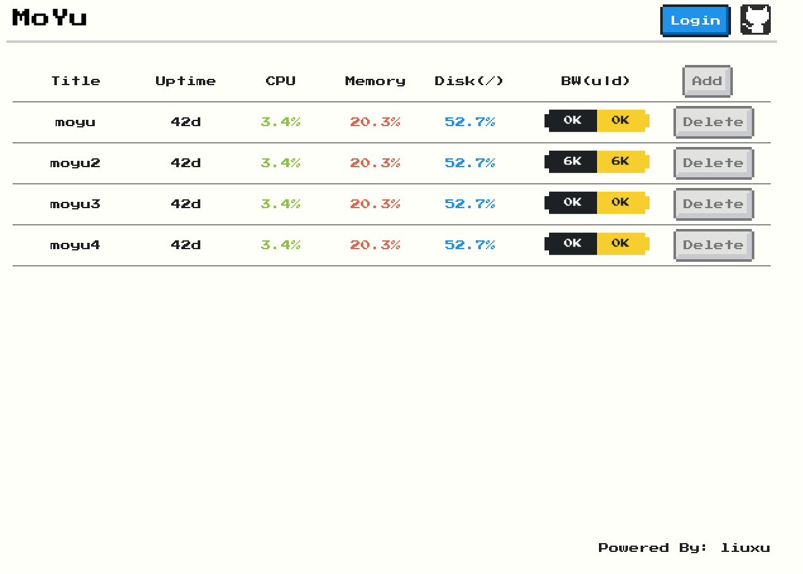
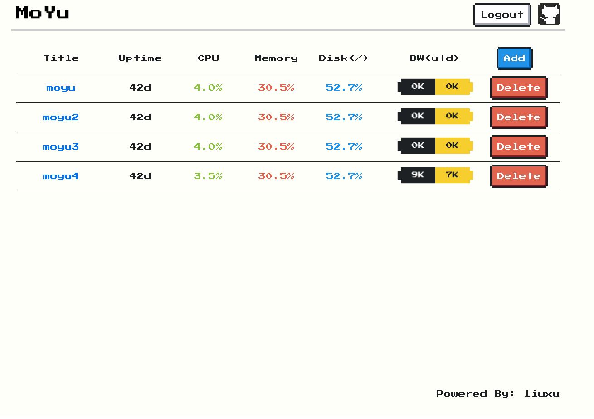
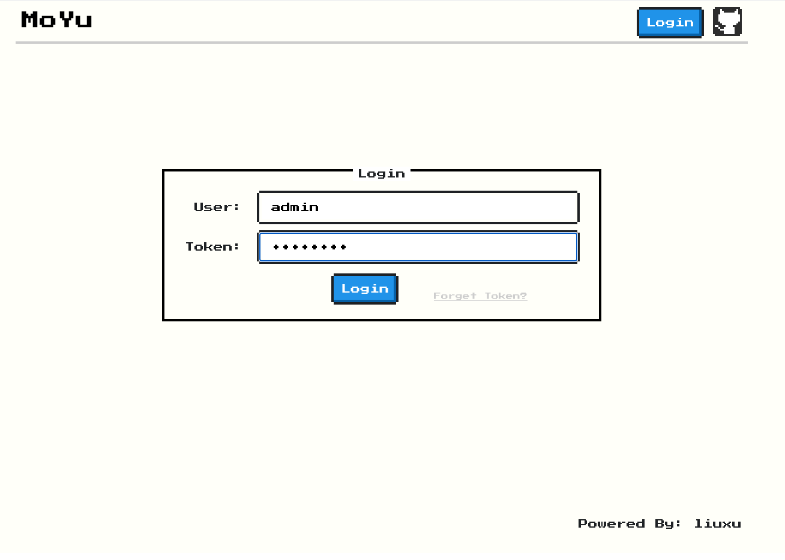

# 墨鱼探针

## 简介

墨鱼探针为主从模式，主为`墨鱼manager`，从为`墨鱼page`。`墨鱼manager`可获取展示多个墨鱼page的简要状态信息，登录后可点击title进入墨鱼page页面。`墨鱼page`独立部署，可独立使用。

技术栈：go(fiber) + vue2 + element-ui + nes.css。

最终将前端和后端全部编译到单个二进制程序中，分为`moyu-manager`和`moyu-page`2个二进制程序。

## 展示

### 墨鱼page


### 墨鱼manager

未登录主页：



已登录主页：



登录页：



添加墨鱼page页面：


## 直接使用release文件

### moyu-page

1. 直接运行
    ```bash
    PORT=8081 ./moyu-page
    ```

### moyu-manager

1. 初始化数据库(第一次运行)
    ```bash
    cat init.sql | sqlite3 db/moyu_manager.db
    ```
2. 目录结构
    ```bash
    ├── bin
    │   └── moyu-manager
    └── db
        └── moyu_manager.db
    ```
3. 运行
    ```bash
    PORT=8080 ./bin/moyu-manager
    ```

4. 添加墨鱼page。如本项目在线demo：`https://moyu-manager.linux.plus/`，直接复制墨鱼page主页`https://moyu-page.linux.plus/`到`添加墨鱼page页面`即可。在墨鱼manager中，如果已登录，可以点击title访问墨鱼page。

## 编译使用

### 依赖：

make: ^4.0

nodejs: ^18.0

go: ^1.19.0

sqlite: ^3.0

### 一键编译

1. 进入项目目录。
    ```bash
    cd moyu
    ```
2. 一键编译。
    ```bash
    make
    ```
3. 运行墨鱼manager和墨鱼page。
    ```bash
    PORT=8081 target/bin/moyu-page
    PORT=8080 target/bin/moyu-manager
    ```
4. （可选）清理项目，删除编译的墨鱼探针二进制等文件。
    ```bash
    make clean
    ```

### 手动编译

#### 编译墨鱼page

1. 进入项目目录。
    ```bash
    cd moyu/page
    ```
2. 编译前端资源。
    ```bash
    cd frontend
    npm run build
    ```
3. 编译后端项目。
    ```bash
    cd ../backend
    go build -o moyu-page --ldflags="-w -s" .
    ```

#### 编译墨鱼manager

1. 进入项目目录。
    ```bash
    cd moyu/manager
    ```
2. 编译前端资源。
    ```bash
    cd frontend
    npm run build
    ```
3. 编译后端项目。
    ```bash
    cd ../backend
    go build -o moyu-manager --ldflags="-w -s" .
    ```

## Docker运行

### 前提说明

#### 墨鱼page

墨鱼page直接运行docker无法获取宿主机信息，需要添加一些运行参数：

1. 由于需要获取宿主机网络接口流量，所以需要以host方式运行docker。
2. 获取磁盘分区信息需要`/proc/N/mountinfo`，所以需要将宿主机的某个进程的文件挂载到docker中，然后设置`HOST_PROC_MOUNTINFO`并运行项目。
3. 项目`PORT`变量默认`8081`，可自行指定其他端口。

#### 墨鱼manager

1. 墨鱼manager依赖`sqlite3`，需要使用`moyu/manager/backend/database/init.sql`创建和初始化用户表数据。
2. 请使用一下目录格式存放`moyu-manager`程序和数据库，容器挂载时需要注意目录位置，默认编译的项目根目录为`/moyu-manager`。
    ```bash
    root@liuxu:/moyu-manager# tree
    .
    ├── bin
    │   └── moyu-manager
    └── db
        └── moyu_manager.db
    ```

### 运行容器

#### 墨鱼page

1. 编译page镜像。
    ```bash
    docker build -t moyu-page -f PageDockerfile .
    ```
2. 单磁盘挂载情况下运行，其中`--network=host`指定使用宿主机网络，`--mount`挂载`dockerd`的进程`mountinfo`文件到docker中，并设置`HOST_PROC_MOUNTINFO`为挂载的文件路径。
    ```bash
    docker run --network=host -e PORT=8081 --mount type=bind,source="/proc/$(pidof dockerd)/mountinfo",target=/root/mountinfo -e HOST_PROC_MOUNTINFO=/root/mountinfo moyu-page
    ```
3. （可选）如果还有其他分区，如我的`/boot/efi`挂载到了独立分区，想获取到这个分区信息，需要把这个目录挂载到docker中。
    ```bash
    docker run --network=host -e PORT=8081 -v /boot/efi:/boot/efi:ro --mount type=bind,source="/proc/$(pidof dockerd)/mountinfo",target=/root/mountinfo -e HOST_PROC_MOUNTINFO=/root/mountinfo moyu-page
    ```

#### 墨鱼manager

1. 编译manager镜像。
    ```bash
    docker build -t moyu-manager -f ManagerDockerfile .
    ```
2. 创建数据库。
    ```bash
    mkdir db
    cat manager/backend/database/init.sql | sqlite3 db/moyu_manager.db
    ```
3. 挂载数据库运行。
    ```bash
    docker run -e PORT=8080 -p 8080:8080 -v ./db:/moyu-manager/db  moyu-manager
    ```

## FAQ

1. 我使用nginx做反代，设置了`location /moyu{}`该怎么办

    答：运行墨鱼page或墨鱼manager时，添加`BASEURL=/moyu`环境变量运行。

2. 运行墨鱼manager，程序报找不到`moyu_manager.db`怎么办

    答：确认自己的目录结构是不是如下：
    ```bash
    ├── bin
    │   └── moyu-manager
    └── db
        └── moyu_manager.db
    ```
    然后进入`bin/`目录下运行`moyu-manager`

3. 我想修改账号或者token

    答：运行sqlite3，通过sql修改。
    ```bash
    sqlite3 moyu_manager.db
    sqlite> UPDATE users SET token='token123' WHERE user='user'
    ```

4. 我想创建新的账户和token

    答：运行sqlite3，通过sql添加。
    ```bash
    sqlite3 moyu_manager.db
    sqlite> INSERT INTO users(user, token) VALUES('user1', 'token1');
    ```
