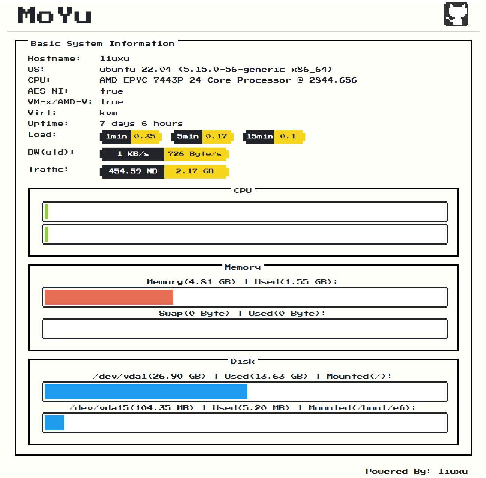

# 墨鱼探针

## 简介

墨鱼探针目前是单页面探针，后期将做成主从架构，用同一个监控面板监控多个vps。

技术栈：go(fiber) + vue2 + element-ui + nes.css。

最终将前端和后端全部编译到一个二进制程序中，方便部署。

## 展示



## Docker运行

### 前提说明

直接运行docker无法获取宿主机信息，需要添加一些运行参数：

1. 由于需要获取宿主机网络接口流量，所以需要以host方式运行docker。
2. 获取磁盘分区信息需要`/proc/N/mountinfo`，所以需要将宿主机的某个进程的文件挂载到docker中，然后设置`HOST_PROC_MOUNTINFO`并运行项目。
3. 项目`PORT`变量默认`8080`，可自行指定其他端口。

### 容器运行

1. 自行编译或下载我编译好的镜像，下载的版本号可以是`latest`或`release`版本号。
    ```bash
    docker build -t moyu .
    docker pull liuxu/moyu
    docker pull liuxu/moyu:v1.0.3
    ```
2. 单磁盘挂载情况下运行，其中`--network=host`指定使用宿主机网络，`--mount`挂载`dockerd`的进程`mountinfo`文件到docker中，并设置`HOST_PROC_MOUNTINFO`为挂载的文件路径。
    ```bash
    docker run --network=host -e PORT=8080 --mount type=bind,source="/proc/$(pidof dockerd)/mountinfo",target=/root/mountinfo -e HOST_PROC_MOUNTINFO=/root/mountinfo liuxu/moyu
    ```
3. （可选）如果还有其他分区，如我的`/boot/efi`挂载到了独立分区，想获取到这个分区信息，需要把这个目录挂载到docker中。
    ```bash
    docker run --network=host -e PORT=8080 -v /boot/efi:/boot/efi:ro --mount type=bind,source="/proc/$(pidof dockerd)/mountinfo",target=/root/mountinfo -e HOST_PROC_MOUNTINFO=/root/mountinfo liuxu/moyu
    ```

## 编译使用

### 依赖：

make: ^4.0

nodejs: ^18.0

go: ^1.19.0

### 一键编译

1. 进入项目目录。

    ```bash
    cd moyu
    ```

2. 一键编译。

    ```bash
    make
    ```

3. 运行墨鱼探针。

    ```bash
    PORT=80 ./backend/moyu
    ```

4. （可选）清理项目，删除编译的墨鱼探针二进制等文件。

    ```bash
    make clean
    ```

### 手动编译

1. 进入项目目录。

    ```bash
    cd moyu
    ```

2. 编译前端资源。

    ```bash
    cd frontend
    npm run build
    ```

3. 编译后端项目。

    ```bash
    cd ../backend
    go build .
    ```

4. 运行墨鱼探针。

    ```bash
    PORT=80 ./moyu
    ```